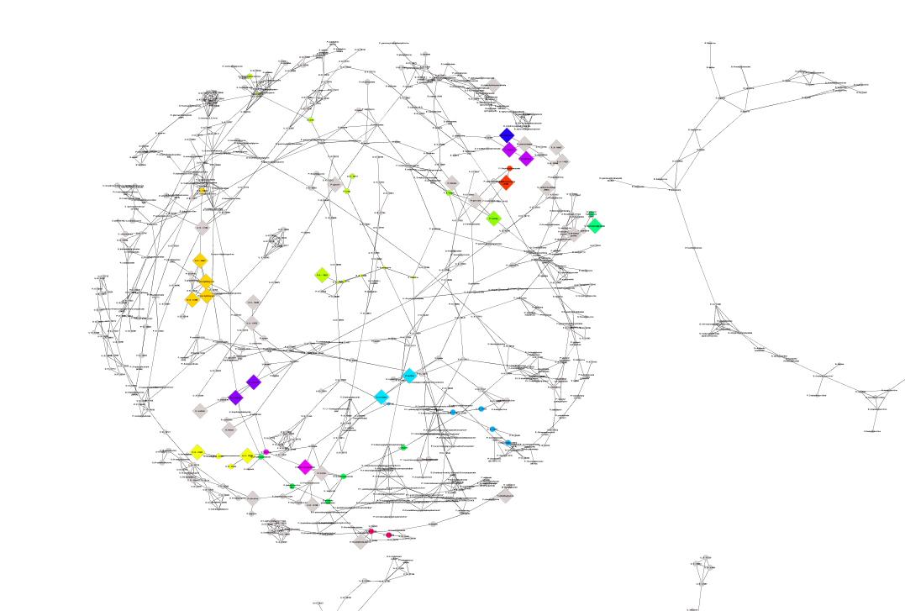

\newpage
#Introduction to *MoDentify* {#intro}
Phenotype associations in large-scale, heterogeneous metabolomics data sets can be expected to be substantially complex, spanning functional modules. Functional modules are commonly defined as groups of correlating entities that are functionally coordinated, coregulated, or generally driven by a common biological process [@mitra2013]. Moreover, phenotypes will associate with metabolic modules at different scales, ranging from global associations spanning entire pathways or even sets of pathways, to localized associations with only few metabolites [@Do2017].  *MoDentify* is an algorithm for the identification of modules at different layers of resolution (both at the fine-grained metabolite level and the more global pathway-level).

Given a [network](#networkinference), a phenotype variable, a [scoring function](#module), and a *seed* (starting) node, a greedy search algorithm identifies an optimal module by score maximization. This module is determined by extending candidate modules along its network edges, until no further score improvement can be achieved (see [Module identification](#moduleidentification)).

## Network inference {#networkinference}
*MoDentify* searches for phenotype associated modules based on a correlation network. Depending on the chosen resolution level, networks are either inferred using metabolite-metabolite correlations or pathway-pathway correlations. To this end, Gaussian graphical models (GGMs) are estimated using the *GeneNet* R package. GGMs are based on partial correlations, which represent associations between two variables corrected for all remaining variables in multivariate Gaussian distributions [@Krumsiek2011]. Required covariates such as age, gender, or body mass index (BMI) can be included into the model. Nodes correspond to the variables of the data set (metabolites, or pathways), and edges between nodes are considered if both Pearson correlations and partial correlations are statistically significant with a chosen significance threshold (e.g. at $\alpha$=0.05) after multiple testing correction. 

## Pathway representation {#pathway}
The pathway network is inferred by calculating a representative variable for each pathway, thereby creating a new data set with pathway representation values for each observations. *MoDentify* provides two approaches for pathway representation:

1) *eigenmetabolite* approach: For each pathway a principal component analysis (PCA) or Singular Value Decomposition (SVD) is performed after scaling all variables to a mean of 0 and a variance of 1. The first principal component - also termed *eigenmetabolite* - is used as a representative value for the entire set of variables in the pathway [@Langfelder2007]. These *eigenmetabolites* are then subjected to the network inference procedure.

2) *average* approach: All variables are scaled such that the mean is 0 and the variance is 1. Subsequently, the pathway representative is calculated as the average of all variable values in the given pathway (average z-score).

If pathways can be assumed to be homogeneous (by sharing common biological or biochemical properties), the *eigenmetabolite* approach can be used. If homogeneity can not be guaranteed, the average approach might be a better choice. In general, it is helpful to explore the explained variances of the *eigenmetabolites* ([See Explained variances](#expvar)). This new data set finally serves as input for the estimation of the pathway GGM.  

## Module representation and scoring {#module}
Based on the network, a greedy approach is used to search for modules by score maximization. The score of a candidate module $M$ is obtained from the multivariable linear regression model:


$$R_M = \beta_{M,0} + \beta_{M,1} \times P + \sum_{i=1}^{|C|} (\beta_{M,i+1}\times c_i) + \epsilon_M$$

where $R_M$ is the module representative value, $\beta_{M,0}$ is the intercept, $\beta_{M,i}$ is the regression coefficient for the respective independent variable, $P$ is the phenotype of interest, $C$ is the set of covariates $c_i$, and $\epsilon_M$ is a normally distributed error term. The module score is then defined as the negative logarithmized p-value of the coefficient $\beta_{M,1}$, which represents the magnitude of phenotype association. Notably, the score of a single component equals its negative logarithmized p-value from a univariate analysis.

$R_M$, the module representative can either be defined by the *eigenmetabolite* approach, or by the average approach as described in section [Pathway representation](#pathway). If modules at pathway level should be identified and $M$ consists of multiple pathways, then $R_M$ is calculated using all metabolites in all pathways independent of pathway assignment. Notably, for module representatives we recommend to use the average approach since modules can be highly heterogeneous.  

## Module identification {#moduleidentification}

Given the scoring function and a seed node, a greedy search procedure is performed to identify an *optimal module*. The algorithm starts with a *seed node* as *candidate module*. The score of the *candidate module* that contains only the seed node is obtained from the univariate differential analysis. In each iteration, the neighborhood of the *candidate module* is identified. Each neighbor (*candidate*) is added to the *candidate module* and the score of the extended *candidate module* is calculated with the scoring function as defined in section [Module representation and scoring](#module). The *candidate* node leading to the highest score improvement is added to the *candidate module* if the module score is higher than the score of each of its single components. The algorithm terminates if no further score improvements can be made, and the *optimal module* is returned. In an optional consolidation step, overlapping *optimal modules*, e.g. from different *seed nodes*, can be combined into one module, which is re-scored by the scoring function. To assess the significance of the modules, a conservative multiple testing correction procedure was used by correcting for the total number of nodes in the underlying network.  


```{r echo=FALSE, out.width="100%"}
library(knitr)
knitr::include_graphics("png_files/MoDentify_scheme.png")
```
  

\newpage

# Prerequisites and installation {#prerequisites}


For visualization of the identified modules in the underlying network, the following software is required:

1. Bioconductor: *RCy3* 
2. *Cytoscape* (>= 3.7.0) available at https://cytoscape.org/download.html
3. The *CyREST* (>= 3.8.0), which automatically installed with Cytoscape >= 3.3.0


Load *MoDentify* with:

```{r message=FALSE, warning=FALSE, results='hide'}
library(MoDentify)
```

\newpage
# Example data set {#data}
In the following, we show an application of *MoDentify* on preprocessed metabolomics data for blood, urine, and saliva samples from the Qatar Metabolomics Study on Diabetes (QMDiab), a type 2 diabetes case-control cohort published in several previous publications [@donetwork2015, @mookkanamori2013, @suhreconnecting2017, @yousri2015].
The study was conducted in 2012 at the Dermatology Department of Hamad Medical Corporation and the Weill Cornell Medical College in Doha, Qatar. Untargeted metabolomics measurements (by Metabolon, Inc.) were available for 190 diabetes patients and 184 non-diabetics of Arab and Asian ethnicities aged 17-81 years. After preprocessing and combining data for all three fluids, 1524 (501 plasma, 734 urine, and 289 saliva) metabolites measured for 310 sindividuals were available.

Raw and preprocessed metabolomics data for blood, urine, and saliva, metabolite pathway annotations, and phenotype information on age, gender, body mass index, and type 2 diabetes status are available at the figshare repository via the following link https://figshare.com/s/9145577a1af99f4de480. The preprocessed data, stored in the three data.tables `qmdiab.data`, `qmdiab.annos`, and `qmdiab.phenos`, is part of *MoDentify* and will be available after installation. 

`qmdiab.data` is a data.frame with metabolites in columns and observations in rows. Each entry corresponds to the preprocessed relative ion counts for the respective metabolite in the respective sample measured by Metabolon, Inc. All variable labels contain the prefixes "P::", "U::", or "S::" indicating metabolites measured in plasma, urine, and saliva, respectively.

```{r message=FALSE, warning=FALSE, results='asis'}
# QMDiab metabolomics data
data("qmdiab.data")
knitr::kable(qmdiab.data[1:4,1:3])
```

`qmdiab.annos` is a data.frame with metabolites as rows and annotations as columns. We used *a priori* pathway annotations from Metabolon, Inc. which assigns each metabolite to one "sub-pathway" representing metabolic pathways and biochemical subclasses (e.g. Branched-chain amino acids), and to one "super-pathway" representing the general chemical or functional class (e.g. Amino acids).

```{r message=FALSE, warning=FALSE, results='asis'}
# QMDiab annotations
data("qmdiab.annos")
knitr::kable(qmdiab.annos[1:4,2:5])
```

Finally, `qmdiab.phenos` is a data.frame containing information about age, gender, body mass index, and type 2 diabetes status for each study participant.

```{r message=FALSE, warning=FALSE, results='asis'}
# QMDiab phenotypes
data("qmdiab.phenos")
knitr::kable(qmdiab.phenos[1:3,])
```


Alternatively, the three data.tables can be generated from the excel file *QMDiab_metabolomics_Preprocessed.xlsx* stored at the Dryad Data Repository:

```{r eval=FALSE}
source(system.file("scripts", "getQmdiabData.R", package = "MoDentify"))
qmdiab <- getQmdiabData("QMDiab_metabolomics_Preprocessed.xlsx")
```

\newpage
#Module identification at metabolite level {#metlevel}

##Network inference

```{r message=FALSE, warning=FALSE, results='hide'}
met.graph <- generateNetwork(data = qmdiab.data, 
                            covars = qmdiab.phenos, 
                            annotations = 
                              qmdiab.annos[,c("name","Super.pathway","Sub.pathway")],
                            correlation.type = "partial",
                            alpha = 0.05, 
                            correction.method = "bonferroni")
```

- `data` is a data.table or data.frame with variables in columns and observations in rows.
- `covars` are the variables that should be included as covariates in the GGM estimation.
- `annotations` is a data.table or data.frame with the column "name" containing the unique names of the variables, and optinally many annotations.
- `correlation.type` can bei either "partial" for Gaussian graphical models or "pearson" for Pearson correlation.
- `alpha` is the significance threshold ($\alpha$) to determine significant partial correlations. 
- `correction.method` is the multiple testing correction method to be used (can be "bonferroni", "BH", "BY", "fdr", "holm", "hochberg", "hommel", or "none" from the function `p.adjust` of package `stats`).

The inferred network is an igraph object with 1524 nodes and 1945 edges.
```{r}
summary(met.graph)
```


Alternatively, a pre-existing network can be used for module identification. Note that all nodes in the network must be available as variables in the input data.

```{r eval=FALSE}
net.DT <- fread(input = system.file("extdata", "qmdiab.network.txt", 
                                    package = "MoDentify"), header = TRUE)

annotations <- fread(input = system.file("extdata", "qmdiab.annotations.txt",
                                         package = "MoDentify"), header = TRUE)

library(igraph)
met.graph <- graph_from_data_frame(d = net.DT,
                                   directed = FALSE,
                                   vertices = annotations)
```


##Edges between variable groups

In metabolomics, it has frequently been observed that metabolites from the same pathways tend to correlate with each other, while there are only few correlations across pathways [@donetwork2015, @Krumsiek2011, @mitra2013]. This trend can be explored in the inferred network by investigating the number of edges within and between pathways:

```{r fig.height = 5.5, fig.width = 6}
ggEdgesBetweenAttributes(met.graph, "Super.pathway", rm.unknown = TRUE)
```


##Module identification

```{r eval=FALSE}
modules.summary <- identifyModules(graph = met.graph,
                                  data = qmdiab.data,
                                  annotations = qmdiab.annos,
                                  covars = qmdiab.phenos[,1:3],
                                  phenotype = qmdiab.phenos$T2D,
                                  alpha = 0.05,
                                  correction.method ="bonferroni",
                                  representative.method = "average")
```

- `graph` is an igraph object loaded from external sources or inferred within *MoDentify*. 
- `data` is a data.table or data.frame with variables in columns and observations in rows.
- `annotations` is a data.table or data.frame with the column "name" containing the unique names of the variables, and optinally many annotations.
- `covars` are the variables that should be included in the scoring function as covariates.
- `phenotype` is the phenotype of interest coded as a vector with the same observations as in `data`. 
- `alpha` is the significance threshold ($\alpha$), which is used to determine significant phenotype associations and to correct for multiple testing. 
- `correction.method` is the multiple testing correction method to be used (can be "bonferroni", "BH", "BY", "fdr", "holm", "hochberg", "hommel", or "none" from the function `p.adjust` of package `stats`).  
- `representative.method` is either "eigenmetabolite" for the *eigenmetabolite* approach, or "average" for the *average* approach to calculate the module representative.
- The output `modules.summary` consists of four data.tables: `modules.summary$modules` contains the module scores and effect sizes. `modules.summary$nodes` and `modules.summary$seeds` contain the score for each node and the assignment to module IDs in `modules.summary$modules`. `modules.summary$cache` contains all *candidate modules*, their scores, and the frequency of access by the algorithm.


Modules can be exported to a file using:

```{r eval=FALSE}
  writeModules(modules.summary, "QMDiab_modules.txt")
```


##Network and module visualization

```{r eval=FALSE}
#- remember to open Cytoscape and activate the CytoscapeRPC plugin
draw.modules(graph = met.graph,
             title = "QMDiab_modules",
             summary = modules.summary,
             save.image = FALSE,
             modules.to.draw = NULL)
```


- `graph` is an igraph object loaded from an external source or inferred by *MoDentify*.
- `title` is the title for the Cytoscape session. 
- `summary` is the output from `identify.networks`. 
- `save.image` is a logical parameter specifying whether png files of the modules should be saved.
- `modules.to.draw` contains the module IDs to be drawn. If this parameter is set to `NULL` all modules will be visualized.


```{r echo=FALSE, out.width="100%"}
library(knitr)

```

\newpage
#Module identification at pathway level {#pathwaylevel}

##Network inference

```{r message=FALSE, warning=FALSE, results='hide'}
pathway.graph <- generatePathwaysNetwork(data = qmdiab.data,
                                         annotations = qmdiab.annos,
                                         level = "Sub.pathway",
                                         correlation.type = "pearson",
                                         alpha = 0.05,
                                         correction.method = "bonferroni",
                                         rm.unknown = TRUE,
                                         representative.method = "eigenmetabolite")
```

- `data` is a data.table or data.frame with variables in columns and observations in rows. 
- `annotations` is a data.table or data.frame with the column "name" containing the unique names of the variables, and optinally many annotations. 
- `correction.method` is the multiple testing correction method to be used (can be "bonferroni", "BH", "BY", "fdr", "holm", or "none" from the function `p.adjust` of package `stats`). 
- `level` is the resolution level. The parameter should be a string of the name of the column containing the pathway assignments to be used. 
- `alpha` is the significance threshold ($\alpha$), which is used to determine significant partial correlations. 
- `correction.method` is the multiple testing correction method for the partial correations ("bonferroni", "BH", "BY", "fdr", "holm", "hochberg", "hommel", or "none" from the function `p.adjust` of package `stats`). 
- `rm.unknown` is `TRUE` if variables with no pathway assignments should be removed. These variables should be labeled with "Unknown" or "NA" in the corresponding pathway column. 
- `representative.method` is either "eigenmetabolite" for the *eigenmetabolite* approach, or "average" for the *average* approach to calculate the pathway representative. 

\newpage
##Explained variances of *eigenmetabolites* {#expvar}

*Eigenmetabolites* are calculated as the first principal components of a PCA. The explained variances can be plotted with:

```{r fig.height = 7.2, fig.width = 7.2}
# plot all pathways
ggExplainedVariance(pathway.graph)
```
\newpage
```{r fig.height = 7.2, fig.width = 7.2}
# plot the first 50 pathways
ggExplainedVariance(pathway.graph, 1:50)
```

##Module identification

```{r eval=FALSE}
pathway.modules <- identifyModules(graph = pathway.graph$network,
                                            data = qmdiab.data,
                                            covars = qmdiab.phenos[,1:3],
                                            phenotype = qmdiab.phenos$T2D,
                                            level = pathway.graph$level,
                                            annotations = qmdiab.annos,
                                            alpha = 0.05,
                                            correction.method ="bonferroni",
                                            representative.method = "average")
```
<!-- We get a warning here: Not all of your variables are represented in graph, 
because we excluded the unknowns here.-->

- `graph` is an igraph object loaded from an external source or inferred within *MoDentify*. 
- `data` is a data.table or data.frame with variables in columns and observations in rows. 
- `covars` are the variables that should be included in the scoring function as covariates.
- `phenotype` is the phenotype of interest coded as a vector with observations as in `data`. 
- `level` is the resolution level. The parameter should be a string of the name of the column containing the pathway assignments to be used. 
- `annotations` is a data.table or data.frame, which must contain the columns "name" and the column name stored in `level`.
- `alpha` is the significance threshold ($\alpha$), which is used to determine significant phenotype associations. 
- `correction.method` is the multiple testing correction method to be used (can be "bonferroni", "BH", "BY", "fdr", "holm", "hochberg", "hommel", or "none" from the function `p.adjust` of package `stats`).
- `representative.method` is either "eigenmetabolite" for the *eigenmetabolite* approach, or "average" for the *average* approach to calculate the module representative. 

##Network and module visualization

```{r eval=FALSE}
draw.modules(graph = pathway.graph$network,
             title = "QMDiab_modules_pw",
             nodes = pathway.modules$nodes,
             modules = pathway.modules$modules,
             save.image = FALSE,
             modules.to.draw = NULL)
```

- `graph` is an igraph object loaded from an external source or inferred by *MoDentify*.
- `title` is the title for the Cytoscape session. 
- `nodes` and `modules` are outputs from `identify.networks`. 
- `save.image` is a logical parameter specifying whether png files of the modules should be saved.
- `modules.to.draw` contains the module IDs to be drawn. If this parameter is set to `NULL` all modules will be visualized.

```{r echo=FALSE, out.width="100%"}
library(knitr)
knitr::include_graphics("png_files/MoDentify_pathway_modules.png")
```

\newpage
#How to cite
To cite *MoDentify*, please cite the following publication:

<!-- @Do2018: -->

Do KD, Rasp D, Kastenmueller G, Suhre K, Krumsiek J.
MoDentify: phenotype-driven module identification in metabolomics networks at different resolutions.
Bioinformatics, 2018
https://doi.org/10.1093/bioinformatics/bty650


\newpage
# References
